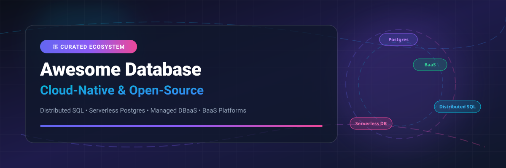

# Awesome Database Ecosystem 🗄️⚡

  
  
  
  
  
  

---

## 📌 Overview & SEO Meta 🔍

**Curated Directory of Database SaaS Platforms & Production-Grade Open-Source Projects**  
*Covering Cloud-Native Managed DBaaS, Distributed SQL, Serverless Postgres, NoSQL, Vector Search, HTAP Engines, and Backend-as-a-Service (BaaS) Frameworks.*

> 💡 **SEO Keywords & Tech Tags**: `database`, `cloud-native-database`, `serverless-postgres`, `distributed-sql`, `dbaas`, `baas`, `htap`, `nosql`, `postgresql`, `tidb`, `cockroachdb`, `yugabyte`, `supabase`, `neon-database`, `planetscale`, `redis`, `clickhouse`, `duckdb`.

---

## 📑 Table of Contents 📖

- [🌐 Market Overview & Dynamics](#-market-overview--dynamics-)
- [☁️ SaaS / Managed Database Platforms](#️-saas--managed-database-platforms-)
- [🔓 Open-Source GitHub Projects](#-open-source-github-projects-)
- [📈 Star History](#-star-history)
- [💖 Support & Community](#-support--community)
- [🤝 How to Contribute](#-how-to-contribute)
- [⚖️ Disclaimer](#️-disclaimer)

---

## 🌐 Market Overview & Dynamics 📊

> 📈 **Estimated Market Size & Industry Concentration**: The Global Database Management System (DBMS) market size is currently estimated at **~$100 Billion – $120 Billion+** and is projected to expand beyond **$180 Billion+ by 2030**. The market structure is **moderately fragmented**: cloud hyperscalers (AWS, Azure, Google Cloud) command massive managed infrastructure market share alongside specialized enterprise category leaders (MongoDB Atlas, Snowflake) and agile open-source/serverless pioneers (Neon, PlanetScale, Supabase, Cockroach Labs, PingCAP).

---

## ☁️ SaaS / Managed Database Platforms 🚀

The following table lists top managed database-as-a-service (DBaaS) products, sorted in **descending order by company valuation / annual market revenue**.

| SaaS Product 🏷️ | Pricing / Starting Tier 💰 | Free Tier / Trial Limits 🎁 | Market Valuation / Revenue 🏢 | Key Features & Architecture ⚡ |
| :--- | :--- | :--- | :--- | :--- |
| **[Microsoft Azure SQL Database](https://azure.microsoft.com/en-us/products/azure-sql/database/)** | `$0.015/vCore/hr` (~`$5.00/mo` serverless GP) | `100,000 vCore seconds/mo free compute + 32 GB storage free every month` | `Microsoft Cloud Rev: ~$140B+/yr (Mkt Cap: ~$3.3T)` | Fully managed SQL Server engine with intelligent automated performance tuning, Serverless auto-scaling, and Multi-AZ high availability. |
| **[Amazon RDS](https://aws.amazon.com/rds/)** | `$0.017/hr` (~`$12.41/mo` db.t4g.micro) | `750 hrs/mo db.t2/t3/t4g.micro for 12 months + 20 GB storage + 20 GB backups` | `AWS Rev: ~$100B+/yr (Amazon Mkt Cap: ~$2.1T)` | AWS managed relational database supporting PostgreSQL, MySQL, MariaDB, Oracle, SQL Server, and Db2 with automated backups. |
| **[Google Cloud SQL](https://cloud.google.com/sql)** | `$0.015/hr` (~`$11.00/mo` db-f1-micro) | `90-day free trial with $300 credits for all GCP services including Cloud SQL` | `GCP Rev: ~$33B+/yr (Alphabet Mkt Cap: ~$2.1T)` | Fully managed PostgreSQL, MySQL, and SQL Server on Google Cloud Platform with built-in failover and automated security patching. |
| **[MongoDB Atlas](https://www.mongodb.com/atlas)** | `$0.08/hr` (~`$57/mo` M10 Dedicated); `$0.10/M reads` Serverless | `Free Forever M0 Shared Cluster with 512 MB storage, shared RAM & multi-region access` | `Valuation / Market Cap: ~$22.0B (Rev: ~$1.8B/yr)` | Industry-leading managed document database providing automatic sharding, multi-region clusters, full-text search, and vector search. |
| **[CockroachDB Cloud](https://www.cockroachlabs.com/)** | `$0.10/vCPU-hr` + `$0.25/GB-mo` (Serverless & Standard) | `30-day free trial with $400 free credits for CockroachDB Dedicated/Serverless` | `Valuation: ~$5.0B (Series F)` | Cloud-native PostgreSQL wire-compatible distributed SQL database built on Raft consensus and Pebble/RocksDB engine for high availability. |
| **[PlanetScale](https://planetscale.com/)** | `$39.00/mo` Scaler plan (includes 10 GB storage & 100B row reads) | `14-day free trial with full Scaler features & non-blocking schema migrations` | `Valuation: ~$850M (Series C)` | MySQL serverless database branching platform powered by Vitess sharding engine, enabling Git-like non-blocking schema migrations. |
| **[YugabyteDB Managed](https://www.yugabyte.com/)** | `$0.25/vCPU-hr` (~`$180/mo` Dedicated cluster) | `Free Forever Sandbox cluster with 1 vCPU, 4 GB RAM & 10 GB storage` | `Valuation: ~$500M (Series C)` | Cloud-native distributed SQL database providing PostgreSQL wire compatibility, fine-grained geo-partitioning, and Spanner-level consistency. |
| **[Supabase](https://supabase.com/)** | `$25.00/mo` Pro Plan (includes 8 GB storage & 250 GB bandwidth) | `Free Forever plan with 500 MB database storage, 5 GB file storage & 50k MAU` | `Valuation: ~$500M (Series B)` | Open-source Firebase alternative adding Realtime WebSockets, auto-generated REST/GraphQL APIs, Auth, Edge Functions, and Vector storage on Postgres. |
| **[Neon](https://neon.tech/)** | `$19.00/mo` Launch plan (includes 10 GB storage & 300 compute hrs) | `Free Forever plan with 0.5 GiB storage, 1 project, 10 branches & 100 compute hrs/mo` | `Valuation: ~$400M (Series B)` | Serverless PostgreSQL platform separating storage from compute, offering instant database branching, autoscaling, and zero-downtime provisioning. |
| **[TiDB Cloud](https://www.pingcap.com/tidb-cloud/)** | `$0.10/million Request Capacity Units (RCU)` Serverless | `Free Forever Serverless plan with 5 GiB row + 5 GiB TiFlash columnar storage & 50M RCUs/mo` | `Valuation: ~$350M (Series D)` | Fully managed MySQL-compatible distributed HTAP database platform supporting simultaneous real-time transactional (OLTP) and analytical (OLAP) workloads. |

---

## 🔓 Open-Source GitHub Projects 🌟

The open-source database ecosystem is exceptionally mature, powering mission-critical infrastructure globally. The following projects are sorted in **descending order by GitHub star counts**.

### 1. **[Supabase](https://github.com/supabase/supabase)**  
  
- **Category**: Backend-as-a-Service (BaaS) / Postgres Platform | **License**: Apache-2.0  
- **Description**: The open-source Firebase alternative. Built on PostgreSQL, Supabase auto-generates RESTful and GraphQL APIs, provides authentication, realtime subscriptions over WebSockets, file storage, and vector extensions (`pgvector`).

### 2. **[Redis](https://github.com/redis/redis)**  
  
- **Category**: In-Memory Data Store / NoSQL Cache | **License**: RSALv2 / SSPLv1  
- **Description**: Ultra-fast in-memory data structure store used as a database, cache, streaming engine, and pub/sub message broker, supporting strings, hashes, lists, sets, sorted sets, and Geospatial indexes.

### 3. **[Meilisearch](https://github.com/meilisearch/meilisearch)**  
  
- **Category**: Search Engine / Vector Search | **License**: MIT  
- **Description**: A lightning-fast, open-source search engine written in Rust that offers instant, type-as-you-search experiences with hybrid search and vector embedding support.

### 4. **[Appwrite](https://github.com/appwrite/appwrite)**  
  
- **Category**: Backend-as-a-Service (BaaS) | **License**: BSD-3-Clause  
- **Description**: End-to-end backend server for web, mobile, and Flutter developers packaged as Docker microservices. Exposes REST and GraphQL APIs for database management, authentication, storage, and serverless cloud functions.

### 5. **[PocketBase](https://github.com/pocketbase/pocketbase)**  
  
- **Category**: Single-File Embedded BaaS | **License**: MIT  
- **Description**: Lightweight single-file Go backend with an embedded SQLite database, realtime subscriptions, authentication, file storage, and an intuitive Web Admin Dashboard.

### 6. **[ClickHouse](https://github.com/ClickHouse/ClickHouse)**  
  
- **Category**: Columnar OLAP Engine | **License**: Apache-2.0  
- **Description**: High-performance column-oriented SQL database management system designed for real-time analytical query processing (OLAP) on petabyte-scale datasets.

### 7. **[TiDB](https://github.com/pingcap/tidb)**  
  
- **Category**: Distributed HTAP Database | **License**: Apache-2.0  
- **Description**: MySQL-compatible distributed Hybrid Transactional and Analytical Processing (HTAP) database featuring horizontal scalability, strong ACID consistency, and columnar analytical execution via TiFlash.

### 8. **[CockroachDB](https://github.com/cockroachdb/cockroach)**  
  
- **Category**: Distributed SQL Engine | **License**: BSL 1.1 / Apache-2.0  
- **Description**: PostgreSQL wire-compatible distributed SQL database inspired by Google Spanner. Built on Raft consensus and Pebble KV storage to survive node, rack, or datacenter failures.

### 9. **[DuckDB](https://github.com/duckdb/duckdb)**  
  
- **Category**: In-Process Analytical Engine | **License**: MIT  
- **Description**: Embedded in-process analytical SQL database engine optimized for fast query execution over analytical workloads (the "SQLite for Analytics").

### 10. **[SurrealDB](https://github.com/surrealdb/surrealdb)**  
  
- **Category**: Multi-Model Database | **License**: BSL 1.1  
- **Description**: Cloud-native multi-model database combining relational, document, graph, key-value, and vector database features into a unified SurrealQL query language.

### 11. **[Neon](https://github.com/neondatabase/neon)**  
  
- **Category**: Serverless Postgres Storage Engine | **License**: Apache-2.0  
- **Description**: Open-source serverless PostgreSQL engine that decouples storage and compute, enabling custom storage pageservers, instant branching, and autoscaling.

### 12. **[PostgreSQL](https://github.com/postgres/postgres)**  
  
- **Category**: Relational Database Management System (RDBMS) | **License**: PostgreSQL License (BSD-like)  
- **Description**: The world's most advanced open-source relational database. Boasting over 35 years of active engineering, PostgreSQL delivers unmatched reliability, complex queries, JSONB document support, and extension flexibility.

### 13. **[MySQL Community Server](https://github.com/mysql/mysql-server)**  
  
- **Category**: Relational Database (RDBMS) | **License**: GPL-2.0  
- **Description**: The world's most widely deployed open-source relational database, powering millions of web applications and web frameworks across the globe.

### 14. **[YugabyteDB](https://github.com/yugabyte/yugabyte-db)**  
  
- **Category**: Distributed SQL Database | **License**: Apache-2.0  
- **Description**: High-performance cloud-native distributed SQL database with PostgreSQL wire-compatibility, built on Raft consensus and customized RocksDB for multi-region resilience.

### 15. **[MariaDB Server](https://github.com/MariaDB/server)**  
  
- **Category**: Relational Database (RDBMS) | **License**: GPL-2.0  
- **Description**: Community-developed, backward-compatible fork of MySQL created by MySQL's original authors, offering pluggable storage engines (Aria, ColumnStore, InnoDB).

### 16. **[Postbase](https://github.com/umrashrf/postbase)**  
  
- **Category**: Local-First Firebase Alternative | **License**: GPL-3.0  
- **Description**: Plug-and-play self-hosted open-source Firebase alternative built with Node.js, Express.js, and PostgreSQL for local-first document storage and authentication.

### 17. **[Fluxend](https://github.com/fluxend/fluxend)**  
  
- **Category**: Go-Based BaaS Engine | **License**: GPL-3.0  
- **Description**: Self-hosted open-source Backend-as-a-Service written in Go that generates dynamic REST APIs via PostgREST directly over PostgreSQL.

---

## 📈 Star History

---

## 💖 Support & Community

Thank you for exploring **Awesome-Database**! If this curated directory helped you select the right database platform or open-source tool for your project, please consider supporting the repository:

- ⭐ **Star this repository** to help other developers and architects discover it.
- 🔀 **Fork & Share** it on your social platforms, blog posts, and tech communities.
- ☕ **Sponsor the Maintainer**: Support continuous updates and maintenance via the [GitHub Sponsors Dashboard](https://github.com/sponsors/ishandutta2007).
- 🔗 **Awesome Curations**: Check out our main index at [Awesome-Awesome-Awesome](https://github.com/ishandutta2007/Awesome-Awesome-Awesome).

---

## 🤝 How to Contribute

Contributions are welcome! Please follow these steps to add or update an entry:

1. Fork the repository.
2. Edit `README.md` keeping the Markdown formatting, tables, badges, and sorting rules intact.
3. Submit a Pull Request with a clear description of the database technology.

---

## ⚖️ Disclaimer

- This directory is **community-curated** for educational and architectural decision-making.
- Databases process sensitive data; always evaluate enterprise security, compliance (GDPR, HIPAA, SOC2), and backup guarantees before production deployment.
